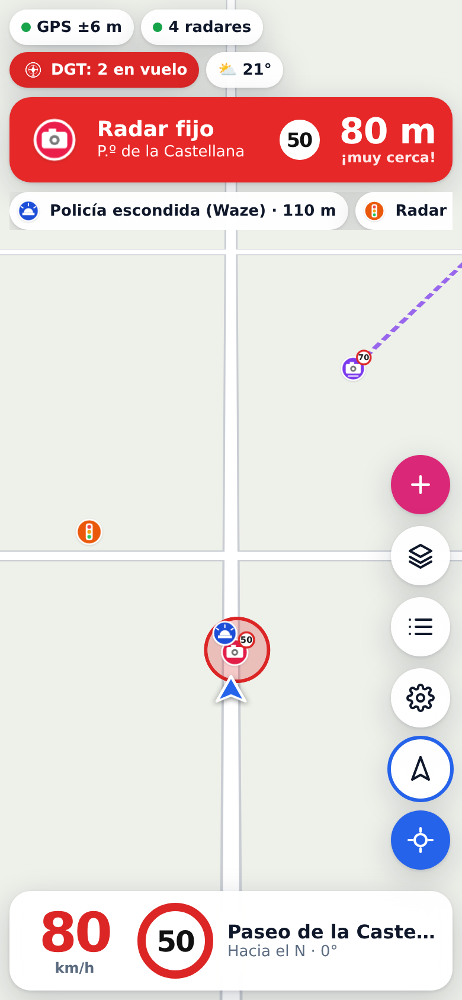
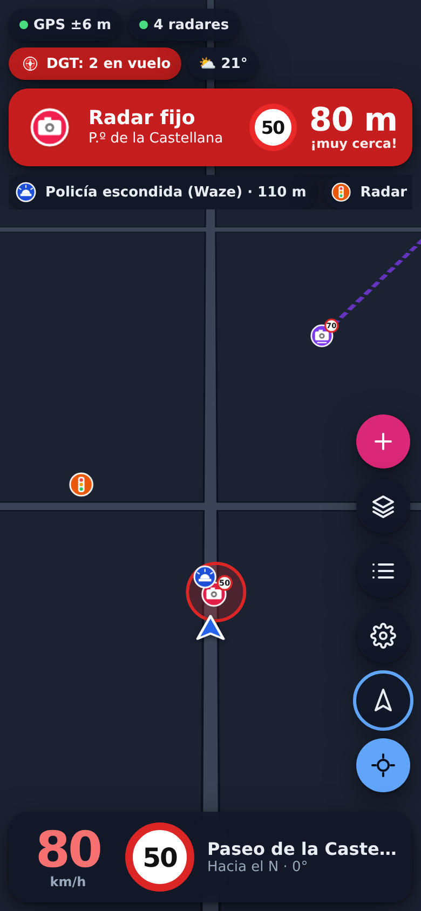
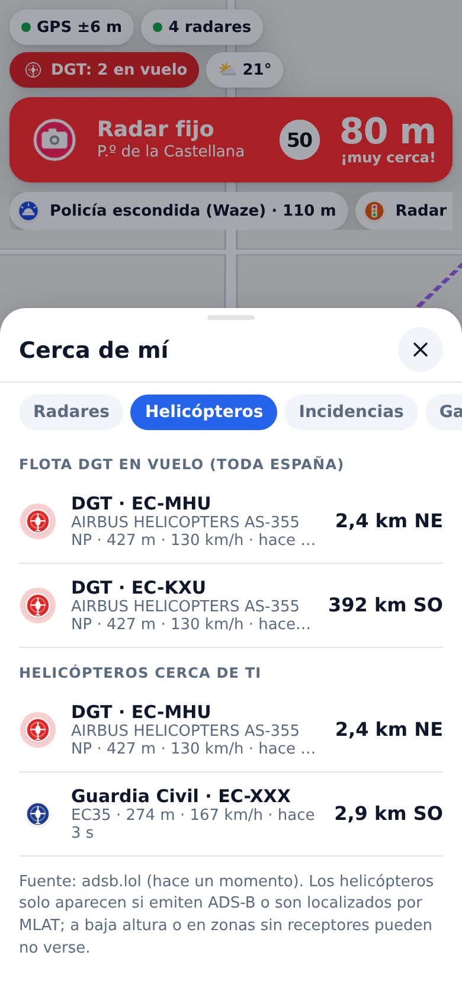

# Radar Bot

Avisador personal de **radares**, **helicópteros Pegasus de la DGT** e **incidencias de tráfico** en toda España.
Es una app web instalable (PWA) pensada para el móvil, con modo claro y oscuro, y un pequeño servidor
que reúne y cachea las fuentes de datos.

<p align="center">
  
  
  
</p>

> Las capturas usan datos de ejemplo.

## Qué hace

**Conducción**
- Mapa en tiempo real con tu posición, rumbo y velocidad (orientado al rumbo o al norte, vista 3D).
- Límite de velocidad de la vía actual: el señalizado en OpenStreetMap o, si no lo hay, el que marca el Reglamento
  (autovía 120, convencional 90, urbana 50 con 2+ carriles por sentido, 30 con uno, 20 en plataforma única),
  detectando si estás en poblado por la densidad de edificios. Se indica de dónde sale el límite.
- Carreteras resaltadas sobre el mapa base (más grosor y contraste) e inclinación 3D configurable.
- Pantalla siempre encendida mientras la app está abierta.
- Diseño para móvil en vertical y en horizontal (soporte de coche), y para escritorio.

**Navegación (como Waze / Google Maps)**
- Buscador de direcciones y lugares (OpenStreetMap), favoritos Casa/Trabajo y recientes.
- Rutas con **paradas intermedias** y **rutas alternativas** (con nº de radares en cada una), opción de evitar peajes o autopistas.
- Instrucciones giro a giro por voz, banner de maniobra, tiempo y hora de llegada, **recálculo** automático si te sales.
- **Zoom automático** al acercarte a un cruce, rotonda o maniobra.
- Mantén pulsado el mapa → «Ir aquí» / «Añadir parada».

**Modos**
- **Modo radares**: tu velocidad enorme y semitransparente sobre el mapa (toca la velocidad del HUD para activarlo).
- **Modo tramo**: curvas coloreadas por severidad (suave → horquilla), velocidad recomendada en cada momento
  (nunca por encima del límite legal), aviso si entras demasiado rápido en una curva, curvas «cantadas» por voz,
  cronómetro manual y **tramos cronometrados** con inicio/fin configurables, salida y llegada automáticas,
  diferencia en directo con tu récord y los 10 mejores tiempos.

**Radares** (fusionando varias bases de datos y eliminando duplicados)
- Fijos, de tramo, de semáforo, radares móviles anunciados por ayuntamientos y ubicaciones de radar remolque.
- Aviso solo de los radares que tienes **por delante y en tu sentido**, con antelación en segundos según tu velocidad,
  segundo aviso al acercarte y alarma si vas por encima del límite.
- **Tramos de velocidad media**: calcula tu media dentro del tramo, lo que queda y la velocidad máxima para terminarlo dentro del límite.
- **Tramos con radar móvil de la DGT** (INVIVE): aviso al entrar en uno.
- Importación de **bases de datos propias** (CSV, GPX, KML, GeoJSON) que se combinan con las oficiales.

**Helicópteros y aeronaves**
- Helicópteros de la DGT (Pegasus) en tiempo real por ADS-B/MLAT, con **radio de aviso configurable** (1–60 km),
  aviso al entrar en el radio y al acercarse, dirección y altura.
- Seguimiento de **toda la flota DGT en vuelo en España** ("DGT: 2 en vuelo").
- Opcional: Guardia Civil, Policía, emergencias y cualquier otro helicóptero o aeronave.
- Lista de matrículas integrada (EC-MHU, EC-MHV, EC-KXU, EC-LDF…) ampliable desde Ajustes (matrículas, hex ICAO, indicativos).

**Avisos e información de tráfico**
- Avisos de usuarios de **Waze**: controles policiales, radares móviles, accidentes, peligros, atascos.
  Es una API no oficial y Waze bloquea a menudo las peticiones automatizadas (HTTP 403); si pasa, el resto de la app sigue funcionando.
- **Incidencias oficiales de la DGT** (obras, cortes, retenciones, meteorología) y **balizas V16** conectadas (vehículos detenidos).
- **Avisos propios**: radar móvil, policía, helicóptero, accidente… en tu posición o manteniendo pulsado el mapa, con caducidad.
  Se guardan en el dispositivo y en el servidor (compartidos entre tus dispositivos).
- **Avisos de la vía** (OpenStreetMap): pasos a nivel, resaltos y badenes, estrechamientos, peajes, señales de peligro
  (animales, desprendimientos…) y, opcionalmente, stops, ceda el paso, semáforos y pasos de peatones de tu camino.
- Tiempo actual y avisos (hielo, niebla, lluvia intensa, viento), **cámaras de tráfico DGT** y **gasolineras con precios oficiales**.
- Estadísticas del viaje (distancia, media, máxima, radares superados).
- Avisos por **voz en español**, pitidos distintos por tipo y vibración (Android).
- **Modo simulación**: recorre una ruta virtual para probar todos los avisos sin conducir.

## Fuentes de datos

| Dato | Fuente | Acceso |
|---|---|---|
| Radares fijos y de tramo (red estatal) | [DGT – Punto de Acceso Nacional](https://nap.dgt.es/dataset/radares-fijos-dgt), DATEX II | servidor |
| Tramos con radar móvil | [DGT – tramos INVIVE](https://nap.dgt.es/es/dataset/tramos-invive) | servidor |
| Radares de Cataluña (fijos, tramo, remolque) | [Servei Català de Trànsit](https://transit.gencat.cat/ca/seguretat_viaria/cinemometres-fixos-trams-mobils/) | servidor |
| Radares de la ciudad de Madrid | [datos.madrid.es](https://datos.madrid.es/dataset/300049-0-radares-fijos-moviles) | servidor |
| Euskadi (Trafikoa), Navarra (Visor de Tráfico) y Donostia | webs oficiales (algunas solo responden a IP española) | servidor |
| Radares móviles municipales (Murcia, León…) | feed abierto [Radares Anunciados](https://github.com/GeiserX/radares-anunciados), opcional: puede no estar publicado | servidor y directo |
| Radares de la comunidad (incluye muchos municipales) | [OpenStreetMap](https://wiki.openstreetmap.org/wiki/Tag:highway%3Dspeed_camera) vía Overpass | servidor y directo |
| Helicópteros / aeronaves | [adsb.lol](https://api.adsb.lol/docs), [airplanes.live](https://airplanes.live/api-guide/), [adsb.fi](https://github.com/adsbfi/opendata), [OpenSky](https://opensky-network.org/) (en cascada) | servidor |
| Incidencias y balizas V16 | [DGT – DATEX II v3](https://nap.dgt.es/dataset/incidencias-dgt-datex2-v3-7) | servidor |
| Avisos de usuarios | Waze Live Map (API no oficial) | servidor |
| Cámaras de tráfico | DGT (CCTV DATEX II) | servidor |
| Límite de velocidad de la vía | OpenStreetMap (Overpass) | directo |
| Tiempo | [Open-Meteo](https://open-meteo.com/) | directo |
| Rutas | [OSRM](https://project-osrm.org/) (servidor de demostración) | servidor y directo |
| Búsqueda | [Photon](https://photon.komoot.io/) y [Nominatim](https://nominatim.org/) | servidor y directo |
| Pasos a nivel, resaltos, peajes… | OpenStreetMap (Overpass) | directo |
| Carburantes | [Ministerio para la Transición Ecológica](https://sedeaplicaciones.minetur.gob.es/ServiciosRESTCarburantes/PreciosCarburantes/) | servidor |
| Mapa base | CARTO (Voyager / Dark Matter), OpenFreeMap, Esri (satélite) | directo |

"Servidor" = lo descarga y cachea el servidor (muchas de estas fuentes no permiten llamadas directas desde el navegador).
Si la app no encuentra servidor, funciona en **modo directo** con el feed agregado y OSM (datos de radares bastante completos,
sin Waze ni incidencias DGT).

La base de datos de radares se guarda en el móvil: **los avisos de radares siguen funcionando sin cobertura**.

## Usarlo en el iPhone sin pagar 99 €/año

No hace falta la App Store: la app es una **PWA**.

1. Despliega el servidor con HTTPS (ver abajo). La geolocalización del navegador **exige HTTPS**.
2. Abre la URL en **Safari** → botón Compartir → **«Añadir a pantalla de inicio»**.
3. Ábrela desde el icono: se ve a pantalla completa como una app. Pulsa **Iniciar** y concede la ubicación.
4. Si configuraste `APP_TOKEN`, introdúcelo en Ajustes → Servidor.

Limitaciones de iOS para apps web, a tener en cuenta:
- Los avisos funcionan **con la app en primer plano** (la pantalla se mantiene encendida). Con la pantalla bloqueada o
  en segundo plano iOS congela la web y no hay avisos ni GPS.
- No hay vibración desde la web en iOS (sí sonido y voz). Comprueba que el interruptor de silencio no silencia los pitidos.
- Para combinarla con otro navegador (Google Maps, Waze…), usa la pantalla dividida en iPad o un segundo móvil.

Si más adelante quieres una app nativa sin cuenta de pago, el mismo código se puede envolver con
[Capacitor](https://capacitorjs.com/) e instalar con AltStore/SideStore o Sideloadly (firma gratuita de 7 días);
eso permitiría GPS y avisos en segundo plano.

## Despliegue

### Opción A: Render (gratis, HTTPS incluido)
1. Haz un fork o usa este repositorio en tu cuenta de GitHub.
2. En [render.com](https://render.com): **New → Blueprint** y selecciona el repo (usa `render.yaml`).
3. Render genera un `APP_TOKEN`: cópialo desde *Environment* y ponlo en la app (Ajustes → Servidor).

El plan gratuito se duerme tras 15 min sin uso: la primera apertura tarda ~1 min. Los datos de radares quedan
guardados en el móvil, así que la app arranca igual.

### Opción B: en casa (Docker, NAS, Raspberry Pi)
```bash
APP_TOKEN=mi-token-secreto docker compose up -d   # http://localhost:8787
```
Para HTTPS desde el móvil sin abrir puertos: [Cloudflare Tunnel](https://developers.cloudflare.com/cloudflare-one/connections/connect-networks/)
o [Tailscale Funnel](https://tailscale.com/kb/1223/funnel). Ventaja extra: con IP española algunas fuentes responden mejor.

### Opción C: en local
```bash
npm install
npm run build && npm start        # http://localhost:8787
```

### Variables de entorno

| Variable | Por defecto | Descripción |
|---|---|---|
| `PORT` | `8787` | Puerto HTTP |
| `DATA_DIR` | `./data` | Cachés persistentes y avisos propios |
| `APP_TOKEN` | — | Si se define, la API exige la cabecera `x-app-token` (o `?token=`) |
| `WARMUP` | `1` | `0` para no precargar radares al arrancar |
| `CLIENT_DIR` | `./dist/client` | Carpeta de la app compilada |
| `AIRCRAFT_PROVIDERS` | todos | Limitar proveedores ADS-B, p. ej. `adsb.fi,airplanes.live` |
| `OPENSKY_CLIENT_ID` / `OPENSKY_CLIENT_SECRET` | — | Credenciales API de OpenSky (cuenta gratuita) para más cuota |

### Si no aparecen helicópteros

Ve a **Fuentes de datos → Comprobar conexiones**: muestra si el servidor llega a adsb.lol, airplanes.live, adsb.fi
y OpenSky. La flota DGT se busca por matrícula, por tipo de aeronave y con un barrido de toda España en todos los
proveedores. Aun así, los helicópteros solo se ven cuando emiten ADS-B o los localiza MLAT, y a baja altura o en
zonas sin receptores es habitual que no aparezcan aunque estén volando.

## Desarrollo

```bash
npm install
npm run dev        # Vite (http://localhost:5173) + API con recarga (puerto 8787)
npm test           # tests (vitest)
npm run typecheck
npm run build
```

Estructura:

```
shared/   lógica común sin dependencias: geo, motor de avisos, fusión de radares, aeronaves, OSM, feed
server/   API Hono: fuentes de datos (DGT, SCT, Madrid, Waze, ADS-B, carburantes…), cachés, avisos propios
src/      app Preact + MapLibre: mapa, HUD, avisos, ajustes, simulación, PWA
tests/    tests de parsers con extractos reales, motor de avisos y utilidades
```

API del servidor: `GET /api/route?points=lat,lon;lat,lon&alt=1`, `/api/geocode?q=`, `/api/diag`, `GET /api/radars`, `/api/events?lat&lon&radius`, `/api/aircraft?lat&lon&radius`, `/api/aircraft/dgt`,
`/api/cameras`, `/api/fuel`, `GET|POST /api/reports`, `DELETE /api/reports/:id`, `/api/health`.

## Aviso legal

Uso personal. La app solo muestra ubicaciones **publicadas** por organismos oficiales, ayuntamientos y comunidades
(OpenStreetMap, Waze); no detecta ni inhibe señales de radar, lo que el art. 18.3 del Reglamento General de Circulación
permite expresamente para los sistemas de aviso. Los datos pueden estar incompletos o desactualizados: respeta siempre
los límites y no manipules el móvil mientras conduces.

Datos: DGT (CC BY), Servei Català de Trànsit (Llicència oberta d'ús d'informació – Catalunya), Ayuntamiento de Madrid
(CC BY 4.0), Radares Anunciados (ODbL), © colaboradores de OpenStreetMap (ODbL), adsb.lol (ODbL), Open-Meteo (CC BY 4.0).
